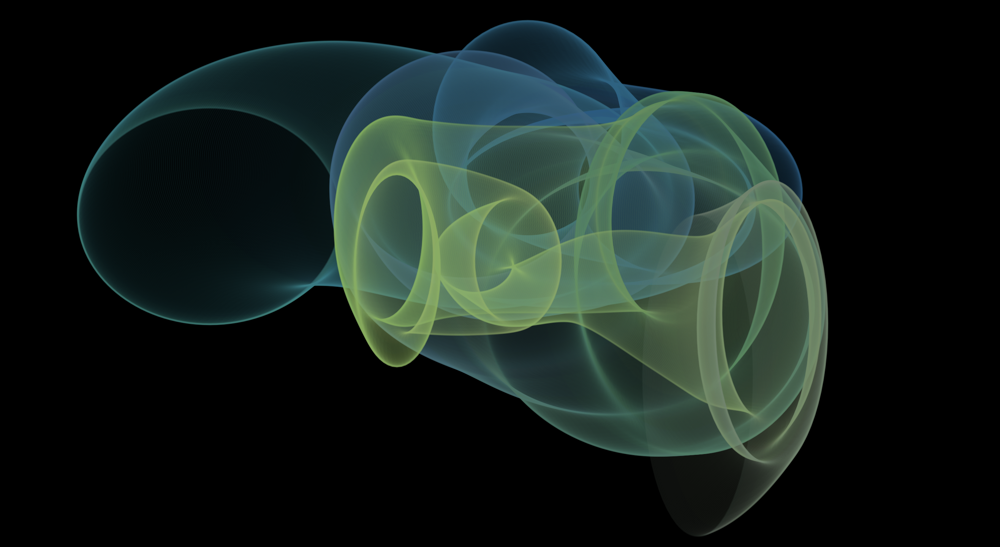
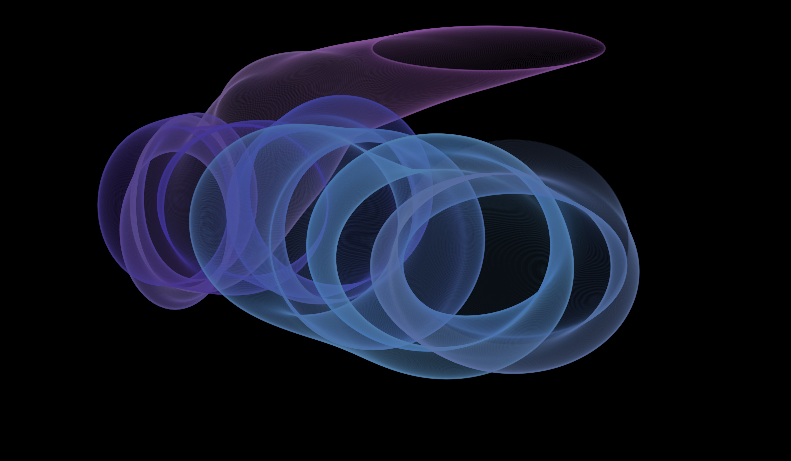
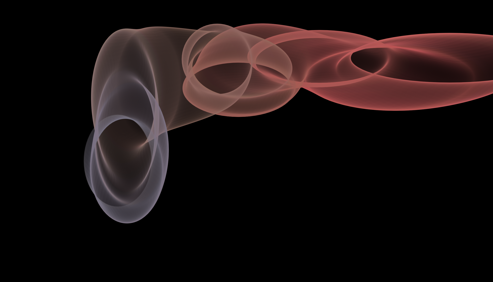
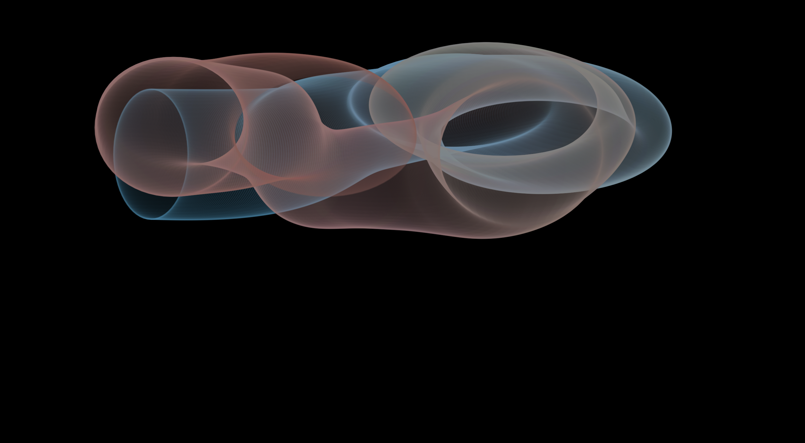
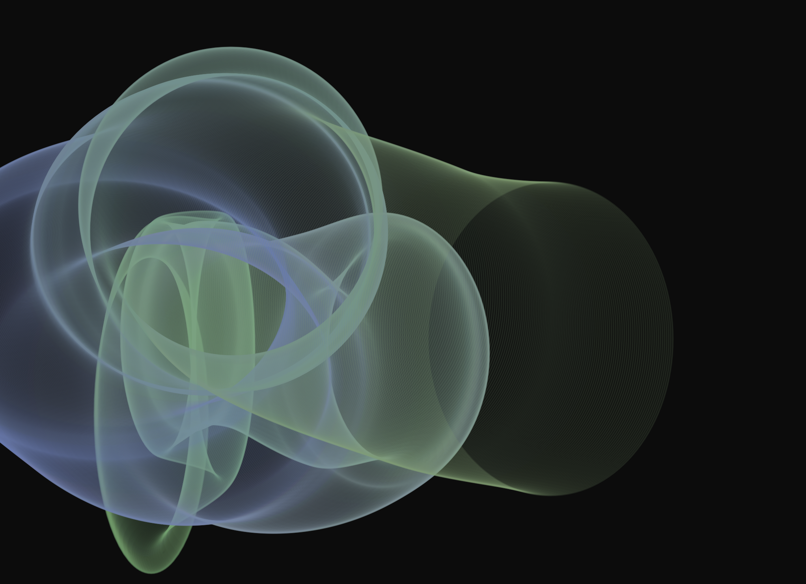

### Final Project - Mollie Lemm

#### Step One: Looking For Inspiration

I searched far and wide to come up with a decent idea for this final project. I wanted to do something interesting, but not something incredibly complex, because I really wanted to fully understand the concepts I was dealing with and why I was writing certain lines. Almost all of the proposals I read dealt with either some kind of simple game or a music visualizer, and while both are interesting, I wanted to do something different than that. I watched a lot of Dan Shiffman's videos looking for inspiration and I came across his videos on Perlin Noise. I decided that I wanted to tackle and understand this concept and use it to create something unique.

#### Step Two: Process

My first step was doing research. I watched through the videos by Dan Shiffman on Perlin, then read through the Wikipedia page and looked for examples from other programmers to see how they had used it. I mostly saw things created with processing, but some were p5.js. Most of the really neat examples I saw were generative art, or screen-saver type things. My first step starting to code was to take other code I found online and play around with different aspects and variables of it to try to better understand how everything worked. This was great because instead of just trying to write my own piece of art, I was able to see how other people's minds worked and how they used the concept. Next, I started to try to develop ideas of what I wanted to do for my sketch. I looked back through my previous projects and noticed that I had a theme of using dark backgrounds and interesting alpha settings. I knew I wanted to stick with this, so that was my starting point. I also loved how dynamic and interesting ellipses are, so I decided that would be my main thing.

#### Step Three: Final Product
My final piece is a generative piece of art that incorporates perlin noise on all of the different aspects, like color, shape, and location. The sketch starts out with a black background and a perlin-generated color of ellipse. The ellipse moves from a perlin-generated amount 60 times a second. The ellipse is thin and has a low alpha, so it creates a shimmering tube-like effect. The height and width of the ellipse also change based on a perlin-generated amount every frame, so the result is a smooth moving tunnel of ellipses. The sketch restarts every 2000 frames, and the background is a perlin-generated grayscale value between 0 and 100. I used the map function a lot because it allowed me to work well with the colors and kept everything organized nicely. Throughout the course of this, I played around quite a bit with all of the different variables, most of all the offset values. This allowed me to fine-tune the speed, direction, and length of gradient of the sketch. Even though this looks simple, it took a lot of trial and error and figuring out to make it into this finished project I am submitting. Overall, I am really proud of this sketch and my ability to take a concept I knew nothing about and generate a neat piece of art from it.

#### A few example screenshots:

