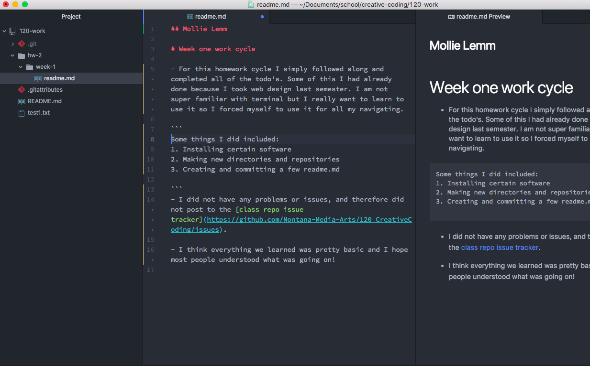

## Mollie Lemm

# Week one work cycle

- For this homework cycle I simply followed along and completed all of the todo's. Some of this I had already done because I took web design last semester. I am not super familiar with terminal but I really want to learn to use it so I forced myself to use it for all my navigating.

```
Some things I did included: 
1. Installing certain software
2. Making new directories and repositories
3. Creating and committing a few new readme.md files

```
- I did not have any problems or issues, and therefore did not post to the [class repo issue tracker](https://github.com/Montana-Media-Arts/120_CreativeCoding/issues).

- I think everything we learned was pretty basic and I hope most people understood what was going on!


