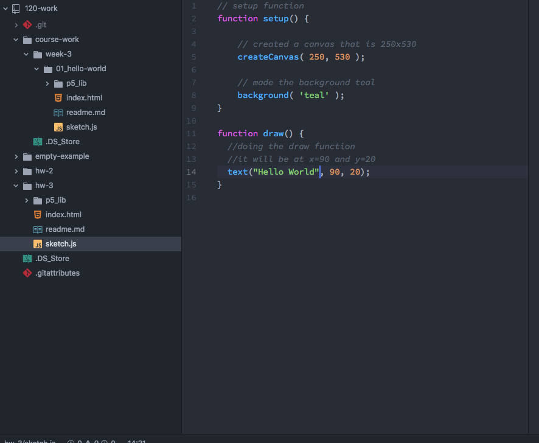

Mollie Lemm

["Hello World" sketch(https://justmolliecate.github.io/120-work/hw-3/)]

## Week three work synopsis

I feel like I zoomed through this week's content. After doing intro to web design a lot of these concepts feel familiar to me even if they are different. I played around for a while with trying different colors to put in the background but then I realized I could just google a list of all the possible colors and that I could use RGB and such to achieve exactly what I wanted if I so choose. To me, this week didn't feel like there was a ton of individual choice. It was mostly about setting things up, which was fine.

Like I said, I worked through this rather quickly and just followed along with the website. I checked out most of the links on the pages and got a feel for the basics of what the code looks like. I didn't have trouble with anything. I'm excited to learn more about how to control and build shapes and how to make things capable of interaction.

#### What my workspace looked like:

