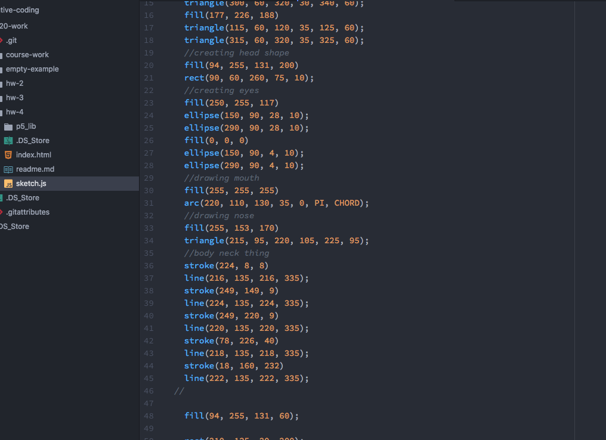

Mollie Lemm

## Drawing a monster

This week was fun. It was really interesting to play around with different shapes and how it functions. I feel like I learned a lot and I figured out how to use the reference sheet.

My process looked like this:
1. Went through course materials
2. Researched a bit what I wanted my monster to look like
3. Started looking through the reference sheet
4. Began drawing and figuring out how to use the coordinate system
5. Played with color and how that works
6. Created this Readme.md!
7. Uploaded.

#### What my workspace looked like:

