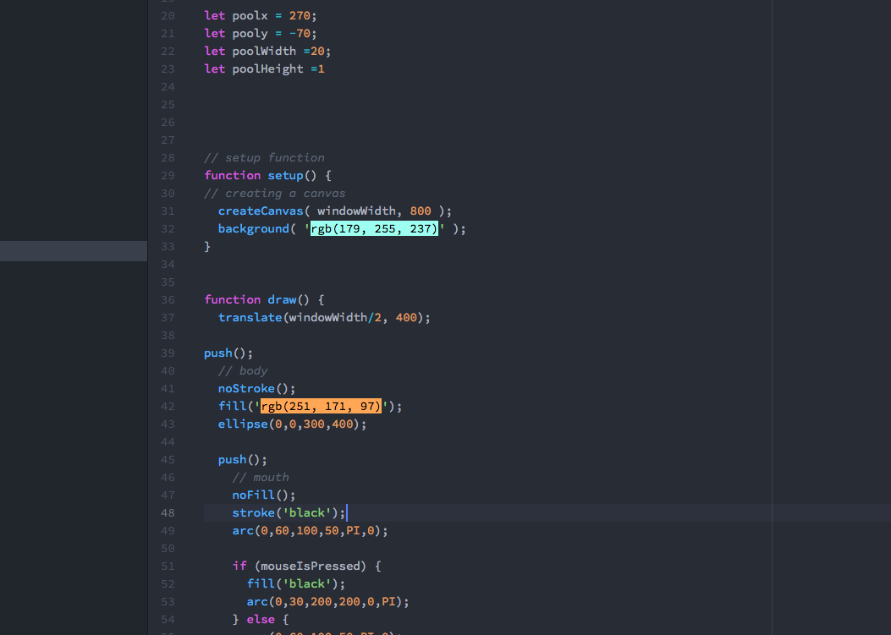

Mollie Lemm

## Basic Animation

I really enjoyed making my potato man successfully cry. It took several tries and a lot of trial and error to get it working like I wanted to and I had to really play with a few different things, but I'm super happy with how my potato guy turned out. This was definitely a lot of work but a lot of fun.

My process looked like this:
1. Went through course materials
2. brainstormed ideas for what I could do
3. Looked at different bits of code to see what I could do.
4. Began outlining the guy and getting a grasp on variables
5. Animated things and played with the effects of different things.
6. Created this Readme.md!
7. Uploaded.

I didn't know how to answer any questions on the thread but I defintitely followed along with what was happening on it.

#### What my workspace looked like:

