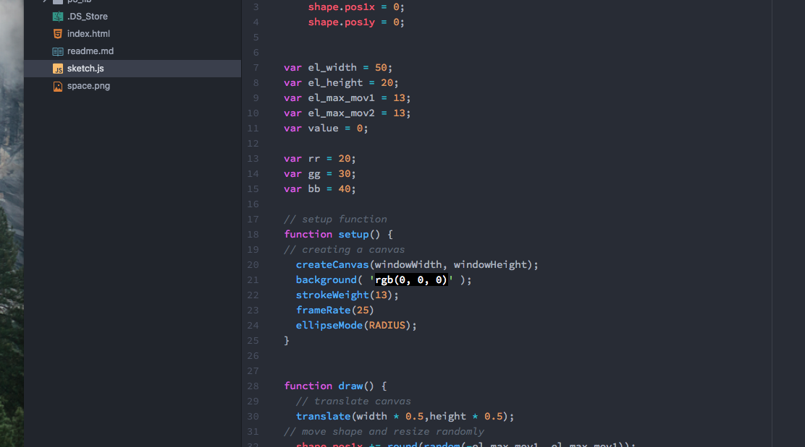

Mollie Lemm

## Math!

Math is definitely not my friend. This project was a lot of trial and error and but I'm happy with the process and what came of it. I think it's cool because it looks like a pulsing eye.

This week, I:

1. Went through the course website
2. Read through the book
3. Started to play with code
4. Read through the book again
5. Looked at the website again
6. Played with more code while referring back to the referrence page
7. Finally got to the point where I felt like I kind of knew what I was doing
8. Kept going
9. Finished
10. Created this and uploaded

#### What my workspace looked like:

